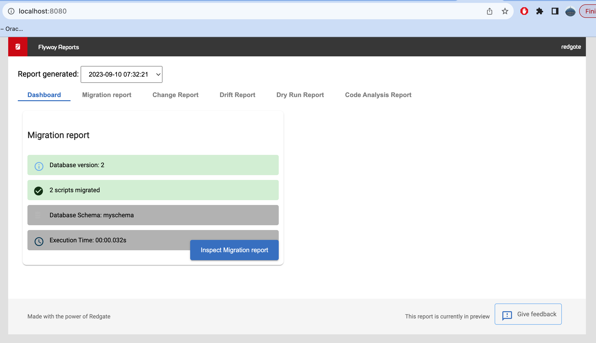
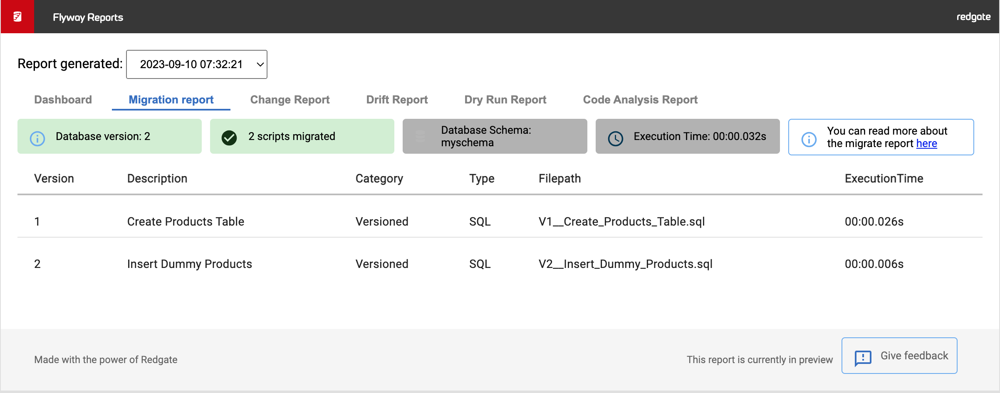
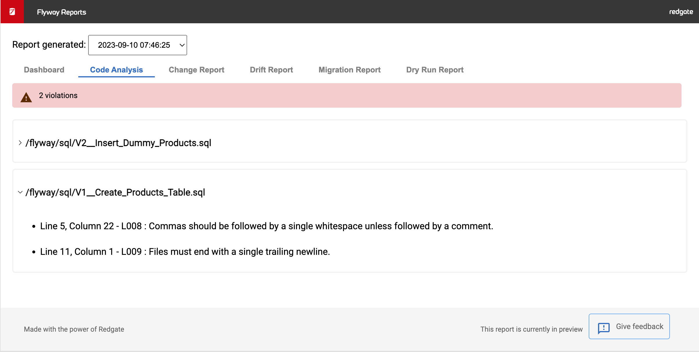

# Hadiya Database Migrations

## Requirements
- Docker

## How it works?

1. The provided docker compose file will spin up 3 containers, viz. MySQL database, Flyway, & Nginx.
2. The flyway container mounts the migration files stored in ```sql/``` directory, performs the migration and generates report in the ```reports/``` directory.
3. The Nginx container mount this ```reports/``` directory inside the ```/usr/share/nginx/html/``` directory and exposes the html report on port 80 which is mapped to your localhost:8080.

## How to use this?

Simple run the following command:
```bash
docker compose up -d
```

The flyway migration reports will be available at ```http://localhost:8080```

## Screenshots

### 1. Dashboard


### 2. Migration Report


### 3. Code Analysis Report
